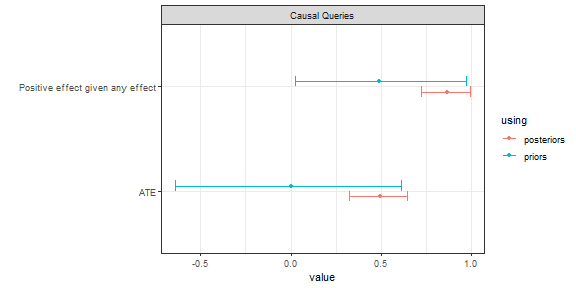

# Getting Started

``` r

library(CausalQueries)
library(dplyr)
library(knitr)
CausalQueries:::enable_stan_parallel(quiet = TRUE)
```

## Make a model

**Generating**: To make a model you need to provide a DAG statement to
`make_model`. For instance

- `"X->Y"`
- `"X -> M -> Y <- X"` or
- `"Z -> X -> Y <-> X"`.

``` r

# examples of models
xy_model <- make_model("X -> Y")
iv_model <- make_model("Z -> X -> Y <-> X")
```

**Size limits**: The number of causal types is the product of the
numbers of nodal types across nodes. A node with $`k`$ parents has
$`2^{2^k}`$ nodal types when types are auto-generated, so the product
grows very quickly in the number of parents. Three parents is
comfortable (2,048 causal types); four parents already implies over a
million causal types, so `make_model` refuses it unless you insist with
`allow_large = TRUE` (warning instead of error) or set
`add_causal_types = FALSE`. Five or more parents cannot have nodal types
auto-generated; pass a restricted `nodal_types` list explicitly.
Restricted types are assessed by their actual lengths, so a many-parent
node with a small type set is fine when the product stays below the
limit.

**Graphing**: Once you have made a model you can inspect the DAG:

``` r

plot(xy_model)
```


Simple model

**Simple summaries:** You can access a simple summary using
[`summary()`](https://rdrr.io/r/base/summary.html)

``` r

summary(xy_model)
#> 
#> Causal statement: 
#> X -> Y
#> 
#> Nodal types: 
#> 
#> Nodal types for X:
#> 0  1
#> 
#> Nodal types for Y:
#> 00  10  01  11
#> 
#> Guide to interpreting nodal types for Y:
#> 
#>   index  interpretation
#> 1    *-  Y = * if X = 0
#> 2    -*  Y = * if X = 1
#> 
#> Number of nodal types by node:
#> X Y 
#> 2 4 
#> 
#> Note: Model does not contain: posterior_distribution, stan_objects;
#> to include these objects use update_model()
#> 
#> Note: To pose causal queries of this model use query_model()
```

or you can examine model details using
[`inspect()`](https://integrated-inferences.github.io/CausalQueries/reference/inspection.md).

**Inspecting**: The model has a set of parameters and a default
distribution over these.

``` r

xy_model |> inspect("parameters_df")
#> 
#> parameters_df
#> Mapping of model parameters to nodal types: 
#> 
#>   param_names: name of parameter
#>   node:        name of endogenous node associated
#>                with the parameter
#>   gen:         partial causal ordering of the
#>                parameter's node
#>   param_set:   parameter groupings forming a simplex
#>   given:       if model has confounding gives
#>                conditioning nodal type
#>   param_value: parameter values
#>   priors:      hyperparameters of the prior
#>                Dirichlet distribution 
#> 
#>   param_names node gen param_set nodal_type given param_value priors
#> 1         X.0    X   1         X          0              0.50      1
#> 2         X.1    X   1         X          1              0.50      1
#> 3        Y.00    Y   2         Y         00              0.25      1
#> 4        Y.10    Y   2         Y         10              0.25      1
#> 5        Y.01    Y   2         Y         01              0.25      1
#> 6        Y.11    Y   2         Y         11              0.25      1
```

**Tailoring**: These features can be edited using `set_restrictions`,
`set_priors` and `set_parameters`.

Here is an example of setting a monotonicity restriction (see
[`?set_restrictions`](https://integrated-inferences.github.io/CausalQueries/reference/set_restrictions.md)
for more):

``` r

iv_model <-
  iv_model |> set_restrictions(decreasing('Z', 'X'))
```

Here is an example of setting priors (see
[`?set_priors`](https://integrated-inferences.github.io/CausalQueries/reference/prior_setting.md)
for more):

``` r

iv_model <-
  iv_model |> set_priors(distribution = "jeffreys")
#> Altering all parameters.
```

**Simulation**: Data can be drawn from a model like this:

``` r

data <- make_data(iv_model, n = 4)

data |> kable()
```

|   Z |   X |   Y |
|----:|----:|----:|
|   0 |   0 |   0 |
|   0 |   0 |   1 |
|   0 |   1 |   0 |
|   0 |   1 |   0 |

## Update the model

**Updating**: Update using `update_model`. You can pass all `rstan`
arguments to `update_model`.

``` r

df <-
  data.frame(X = rbinom(100, 1, .5)) |>
  mutate(Y = rbinom(100, 1, .25 + X*.5))

xy_model <-
  xy_model |>
  update_model(df, refresh = 0)
```

**Inspecting**: You can access the posterior distribution on model
parameters directly thus:

``` r


xy_model |> grab("posterior_distribution") |>
  head() |> kable()
```

|       X.0 |       X.1 |      Y.00 |      Y.10 |      Y.01 |      Y.11 |
|----------:|----------:|----------:|----------:|----------:|----------:|
| 0.5257842 | 0.4742158 | 0.2294933 | 0.0029064 | 0.5439737 | 0.2236266 |
| 0.4740826 | 0.5259174 | 0.0056510 | 0.1261147 | 0.6788035 | 0.1894309 |
| 0.4318490 | 0.5681510 | 0.0758239 | 0.1937347 | 0.6477420 | 0.0826994 |
| 0.4642383 | 0.5357617 | 0.2444708 | 0.0269974 | 0.4639717 | 0.2645601 |
| 0.4535094 | 0.5464906 | 0.0812380 | 0.0913027 | 0.6687678 | 0.1586915 |
| 0.4256022 | 0.5743978 | 0.1076395 | 0.1199029 | 0.5691117 | 0.2033459 |

where each row is a draw of parameters.

## Query the model

### Arbitrary queries

**Querying**: You ask arbitrary causal queries of the model.

Examples of *unconditional* queries:

``` r

xy_model |>
  query_model("Y[X=1] > Y[X=0]",
              using = c("priors", "posteriors"))
#> Prior distribution added to model
#> 
#> Causal queries generated by query_model (all at population level)
#> 
#> |label           |using      |  mean|    sd| cred.low| cred.high|
#> |:---------------|:----------|-----:|-----:|--------:|---------:|
#> |Y[X=1] > Y[X=0] |priors     | 0.249| 0.192|    0.007|     0.704|
#> |Y[X=1] > Y[X=0] |posteriors | 0.595| 0.092|    0.402|     0.756|
```

This query asks the probability that $`Y(1)> Y(0)`$.

Examples of *conditional* queries:

``` r

xy_model |>
  query_model("Y[X=1] > Y[X=0] :|: X == 1 & Y == 1", using = c("priors", "posteriors"))
#> Prior distribution added to model
#> 
#> Causal queries generated by query_model (all at population level)
#> 
#> |label                                 |using      |  mean|    sd| cred.low| cred.high|
#> |:-------------------------------------|:----------|-----:|-----:|--------:|---------:|
#> |Y[X=1] > Y[X=0] given X == 1 & Y == 1 |priors     | 0.490| 0.289|    0.025|     0.973|
#> |Y[X=1] > Y[X=0] given X == 1 & Y == 1 |posteriors | 0.745| 0.111|    0.530|     0.959|
```

This query asks the probability that $`Y(1) > Y(0)`$*given* $`X=1`$ and
$`Y=1`$; it is a type of “causes of effects” query. Note that “:\|:” is
used to separate the main query element from the conditional statement
to avoid ambiguity, since “\|” is reserved for the “or” operator.

Queries can even be conditional on counterfactual quantities. Here the
probability of a positive effect given *some* effect:

``` r

xy_model |>
  query_model("Y[X=1] > Y[X=0] :|: Y[X=1] != Y[X=0]",
              using = c("priors", "posteriors"))
#> Prior distribution added to model
#> 
#> Causal queries generated by query_model (all at population level)
#> 
#> |label                                  |using      |  mean|    sd| cred.low| cred.high|
#> |:--------------------------------------|:----------|-----:|-----:|--------:|---------:|
#> |Y[X=1] > Y[X=0] given Y[X=1] != Y[X=0] |priors     | 0.501| 0.289|    0.023|     0.972|
#> |Y[X=1] > Y[X=0] given Y[X=1] != Y[X=0] |posteriors | 0.863| 0.075|    0.719|     0.990|
```

Note that we use “:” to separate the base query from the condition
rather than “\|” to avoid confusion with logical operators.

### Output

Query output is ready for printing as tables, but can also be plotted,
which is especially useful with batch requests:

``` r

batch_queries <- xy_model |>
  query_model(queries = list(ATE = "Y[X=1] - Y[X=0]",
                             `Positive effect given any effect` = "Y[X=1] > Y[X=0] :|: Y[X=1] != Y[X=0]"),
              using = c("priors", "posteriors"),
              expand_grid = TRUE)
#> Prior distribution added to model
#> Prior distribution added to model

batch_queries |> kable(digits = 2, caption = "tabular output")
```

| label | query | given | using | case_level | mean | sd | cred.low | cred.high |
|:---|:---|:---|:---|:---|---:|---:|---:|---:|
| ATE | Y\[X=1\] - Y\[X=0\] | \- | priors | FALSE | 0.00 | 0.32 | -0.64 | 0.61 |
| ATE | Y\[X=1\] - Y\[X=0\] | \- | posteriors | FALSE | 0.49 | 0.08 | 0.32 | 0.64 |
| Positive effect given any effect | Y\[X=1\] \> Y\[X=0\] | Y\[X=1\] != Y\[X=0\] | priors | FALSE | 0.49 | 0.29 | 0.03 | 0.97 |
| Positive effect given any effect | Y\[X=1\] \> Y\[X=0\] | Y\[X=1\] != Y\[X=0\] | posteriors | FALSE | 0.86 | 0.07 | 0.72 | 0.99 |

tabular output {.table style="width:100%;"}

``` r

batch_queries |> plot()
```



Simple query
