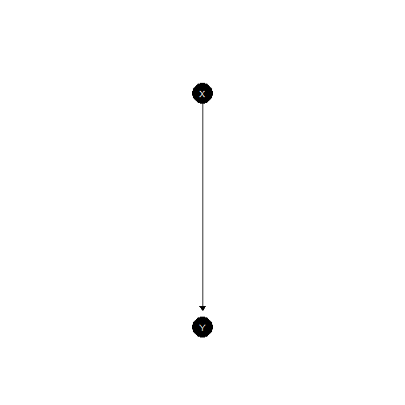
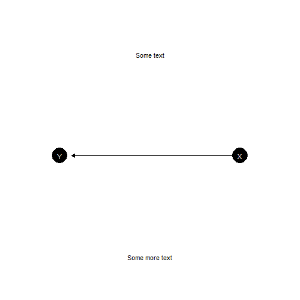
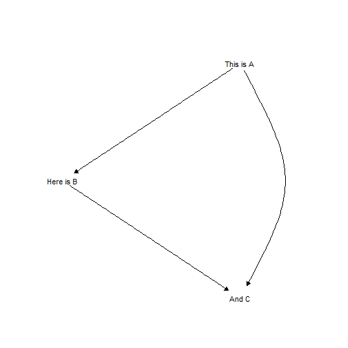
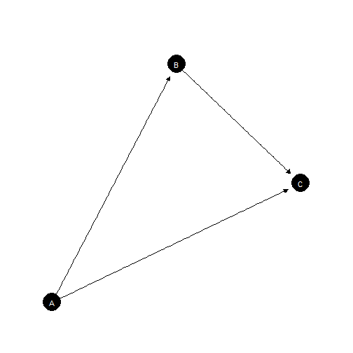
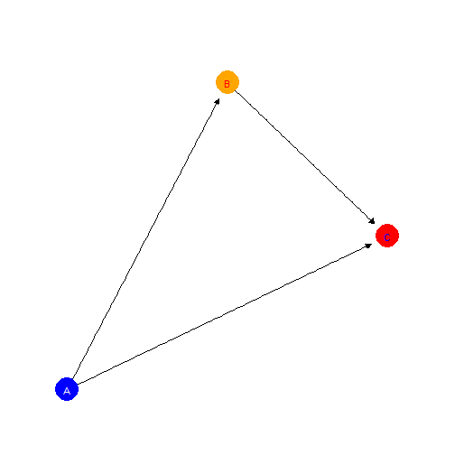
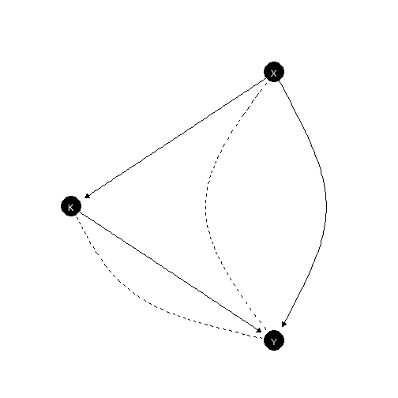
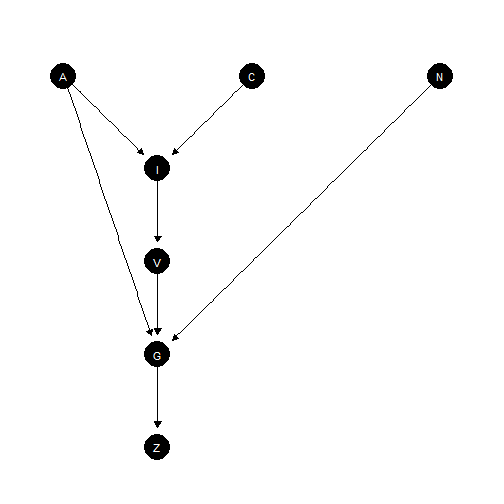
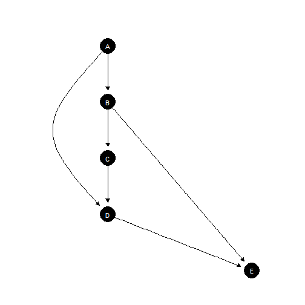
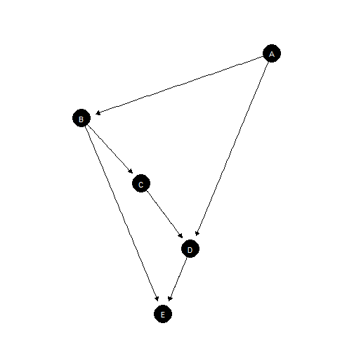

# Plotting models

Plotting functionality makes use of the Sugiyama layout from igraph
which plots nodes to reflect their position in a causal ordering.

The `plot` method calls `plot_model` and passes provided arguments to
it.

### A basic plot:

``` r

model <- make_model("X -> Y")

model |> plot_model()
```



Simple model

### ggplot layers

The model that is produced is a `ggplot` object and additional layers
can be added in the usual way.

``` r

model |>
  plot_model()  +
  annotate("text", x = c(1, -1) , y = c(1.5, 1.5), label = c("Some text", "Some more text")) +
  coord_flip()
#> Coordinate system already present.
#> ℹ Adding new coordinate system, which will replace the existing one.
```



Adding additional `ggplot` layers

### Adding labels

Provide labels in the same order as model nodes.

``` r

model <- make_model("A -> B -> C <- A")


# Check node ordering
inspect(model, "nodes")
#> 
#> Nodes: 
#> A, B, C

# Provide labels
model |>
   plot_model(
     labels = c("This is A", "Here is B", "And C"),
     nodecol = "white", textcol = "black")
```



Adding labels

### Controlling positions

You can manually set positions using the `x_coord` and `y_coord`
arguments.

You can manually set positions using the `x_coord` and `y_coord`
arguments.

``` r

model |>
  plot(x_coord = 0:2,  y_coord = c(0, 2, 1))
```



Specifying coordinates

### Controlling color

You can manually control node color and text color for all nodes
together or separately.

``` r

model |>
  plot(x_coord = 0:2,  y_coord = c(0, 2, 1),
       nodecol = c("blue", "orange", "red"),
       textcol = c("white", "red", "blue"))
```



Controlling colors

## Models with unobserved confounding

Unobserved confounding is represented using dashed curves.

``` r

make_model('X -> K -> Y <- X; X <-> Y; K <-> Y') |>   plot()
```



Plot showing confounding

## More complex models

### Effective node placement

``` r

make_model("I -> V -> G <- N; C -> I <- A -> G; G -> Z",
           add_causal_types = FALSE) |>
  plot()
```



Node positioning for complex model

### Manual coordinates

Default node placement here requires curves.

``` r

make_model("D <- A -> B -> C -> D -> E; B -> E",
           add_causal_types = FALSE) |>
  plot()
```



Poor node placement

Simpler alternative using manual node placement:

``` r

make_model("D <- A -> B -> C -> D -> E; B -> E",
           add_causal_types = FALSE) |>
  plot(x_coord = c(.4, -.3, -.08, .1, 0), y_coord = 5:1)
```



Manual node placement
