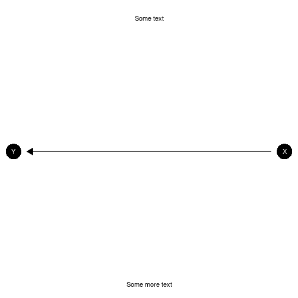

``` r
library(CausalQueries)
library(dplyr)
library(knitr)
```

# Make a model

**Generating**: To make a model you need to provide a DAG statement to `make_model`.
For instance

* `"X->Y"`
*  `"X -> M -> Y <- X"` or
* `"Z -> X -> Y <-> X"`.


``` r
# examples of models
xy_model <- make_model("X -> Y")
iv_model <- make_model("Z -> X -> Y <-> X")
```

**Graphing**: Once you have made a model you can inspect the DAG:


``` r
plot(xy_model)
```



**Simple summaries:** You can access a simple summary using `summary()`


``` r
summary(xy_model)
#> 
#> Causal statement: 
#> X -> Y
#> 
#> Nodal types: 
#> $X
#> 0  1
#> 
#>   node position display interpretation
#> 1    X       NA      X0          X = 0
#> 2    X       NA      X1          X = 1
#> 
#> $Y
#> 00  10  01  11
#> 
#>   node position display interpretation
#> 1    Y        1   Y[*]*      Y | X = 0
#> 2    Y        2   Y*[*]      Y | X = 1
#> 
#> Number of types by node:
#> X Y 
#> 2 4 
#> 
#> Number of causal types:  8
#> 
#> Note: Model does not contain: posterior_distribution, stan_objects;
#> to include these objects use update_model()
#> 
#> Note: To pose causal queries of this model use query_model()
```

or you can examine model details using `inspect()`.

**Inspecting**: The model has a set of parameters and a default distribution over these.


``` r
xy_model |> inspect("parameters_df")
#> 
#> parameters_df
#> Mapping of model parameters to nodal types: 
#> 
#>   param_names: name of parameter
#>   node:        name of endogeneous node associated
#>                with the parameter
#>   gen:         partial causal ordering of the
#>                parameter's node
#>   param_set:   parameter groupings forming a simplex
#>   given:       if model has confounding gives
#>                conditioning nodal type
#>   param_value: parameter values
#>   priors:      hyperparameters of the prior
#>                Dirichlet distribution 
#> 
#>   param_names node gen param_set nodal_type given param_value priors
#> 1         X.0    X   1         X          0              0.50      1
#> 2         X.1    X   1         X          1              0.50      1
#> 3        Y.00    Y   2         Y         00              0.25      1
#> 4        Y.10    Y   2         Y         10              0.25      1
#> 5        Y.01    Y   2         Y         01              0.25      1
#> 6        Y.11    Y   2         Y         11              0.25      1
```

**Tailoring**: These features can be edited using `set_restrictions`, `set_priors` and `set_parameters`.

Here is an example of setting a monotonicity restriction  (see `?set_restrictions` for more):


``` r
iv_model <-
  iv_model |> set_restrictions(decreasing('Z', 'X'))
```

Here is an example of setting priors (see `?set_priors` for more):


``` r
iv_model <-
  iv_model |> set_priors(distribution = "jeffreys")
#> Altering all parameters.
```

**Simulation**: Data can be drawn from a model like this:


``` r
data <- make_data(iv_model, n = 4)

data |> kable()
```


|  Z|  X|  Y|
|--:|--:|--:|
|  0|  0|  1|
|  1|  0|  1|
|  1|  1|  0|
|  1|  1|  0|


# Update the model

**Updating**: Update using `update_model`. You can pass all `rstan` arguments to `update_model`.


``` r
df <-
  data.frame(X = rbinom(100, 1, .5)) |>
  mutate(Y = rbinom(100, 1, .25 + X*.5))

xy_model <-
  xy_model |>
  update_model(df, refresh = 0)
```

**Inspecting**: You can access the posterior distribution on model parameters directly thus:


``` r

xy_model |> grab("posterior_distribution") |>
  head() |> kable()
```


|       X.0|       X.1|      Y.00|      Y.10|      Y.01|      Y.11|
|---------:|---------:|---------:|---------:|---------:|---------:|
| 0.5515163| 0.4484837| 0.2847141| 0.1177726| 0.5741150| 0.0233983|
| 0.5265501| 0.4734499| 0.1473281| 0.2074736| 0.6224344| 0.0227639|
| 0.4597457| 0.5402543| 0.2233002| 0.1362462| 0.3923527| 0.2481008|
| 0.5754801| 0.4245199| 0.1631742| 0.1542270| 0.6013710| 0.0812279|
| 0.6779082| 0.3220918| 0.1429733| 0.1443515| 0.6242878| 0.0883874|
| 0.5075180| 0.4924820| 0.0409841| 0.2349819| 0.6799476| 0.0440865|


where each row is a draw of parameters.

# Query the model

## Arbitrary queries

**Querying**: You ask arbitrary causal queries of the model.

Examples of *unconditional* queries:


``` r
xy_model |>
  query_model("Y[X=1] > Y[X=0]",
              using = c("priors", "posteriors"))
#> 
#> Causal queries generated by query_model (all at population level)
#> 
#> |label           |using      |  mean|    sd| cred.low| cred.high|
#> |:---------------|:----------|-----:|-----:|--------:|---------:|
#> |Y[X=1] > Y[X=0] |priors     | 0.249| 0.195|    0.008|     0.722|
#> |Y[X=1] > Y[X=0] |posteriors | 0.552| 0.104|    0.327|     0.725|
```

This query asks the probability that $Y(1)> Y(0)$.

Examples of *conditional* queries:


``` r
xy_model |>
  query_model("Y[X=1] > Y[X=0] :|: X == 1 & Y == 1", using = c("priors", "posteriors"))
#> 
#> Causal queries generated by query_model (all at population level)
#> 
#> |label                                 |using      |  mean|    sd| cred.low| cred.high|
#> |:-------------------------------------|:----------|-----:|-----:|--------:|---------:|
#> |Y[X=1] > Y[X=0] given X == 1 & Y == 1 |priors     | 0.498| 0.288|    0.027|     0.971|
#> |Y[X=1] > Y[X=0] given X == 1 & Y == 1 |posteriors | 0.779| 0.126|    0.514|     0.983|
```

This query asks the probability that $Y(1) > Y(0)$ *given* $X=1$ and $Y=1$; it is a type of "causes of effects" query. Note that ":|:" is used to separate the main query element from the conditional statement to avoid ambiguity, since "|" is reserved for the "or" operator.

Queries can even be conditional on counterfactual quantities. Here the probability of a positive effect given *some* effect:


``` r
xy_model |>
  query_model("Y[X=1] > Y[X=0] :|: Y[X=1] != Y[X=0]",
              using = c("priors", "posteriors"))
#> 
#> Causal queries generated by query_model (all at population level)
#> 
#> |label                                  |using      |  mean|    sd| cred.low| cred.high|
#> |:--------------------------------------|:----------|-----:|-----:|--------:|---------:|
#> |Y[X=1] > Y[X=0] given Y[X=1] != Y[X=0] |priors     | 0.494| 0.291|    0.020|     0.977|
#> |Y[X=1] > Y[X=0] given Y[X=1] != Y[X=0] |posteriors | 0.829| 0.085|    0.673|     0.991|
```

Note that we use ":" to separate the base query from the condition rather than "|" to avoid confusion with logical operators.

## Output

Query output is ready for printing as tables, but can also be plotted, which is especially useful with batch requests:


``` r
batch_queries <- xy_model |>
  query_model(queries = list(ATE = "Y[X=1] - Y[X=0]",
                             `Positive effect given any effect` = "Y[X=1] > Y[X=0] :|: Y[X=1] != Y[X=0]"),
              using = c("priors", "posteriors"),
              expand_grid = TRUE)

batch_queries |> kable(digits = 2, caption = "tabular output")
```


Table: tabular output

|label                            |query           |given            |using      |case_level |  mean|   sd| cred.low| cred.high|
|:--------------------------------|:---------------|:----------------|:----------|:----------|-----:|----:|--------:|---------:|
|ATE                              |Y[X=1] - Y[X=0] |-                |priors     |FALSE      | -0.01| 0.32|    -0.64|      0.62|
|ATE                              |Y[X=1] - Y[X=0] |-                |posteriors |FALSE      |  0.43| 0.09|     0.24|      0.59|
|Positive effect given any effect |Y[X=1] > Y[X=0] |Y[X=1] != Y[X=0] |priors     |FALSE      |  0.50| 0.29|     0.03|      0.98|
|Positive effect given any effect |Y[X=1] > Y[X=0] |Y[X=1] != Y[X=0] |posteriors |FALSE      |  0.83| 0.09|     0.67|      0.99|


``` r
batch_queries |> plot()
```


