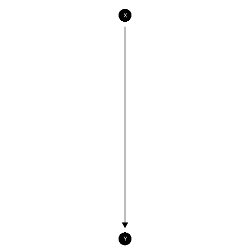
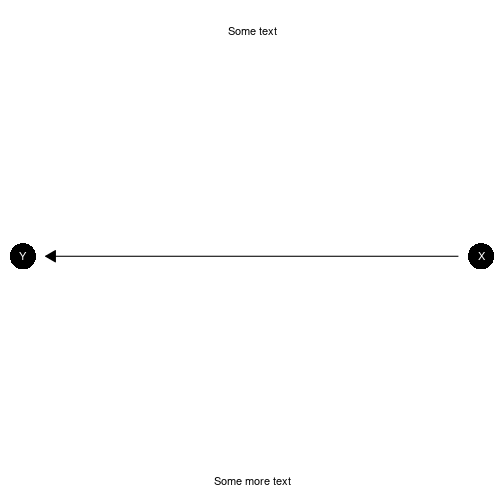
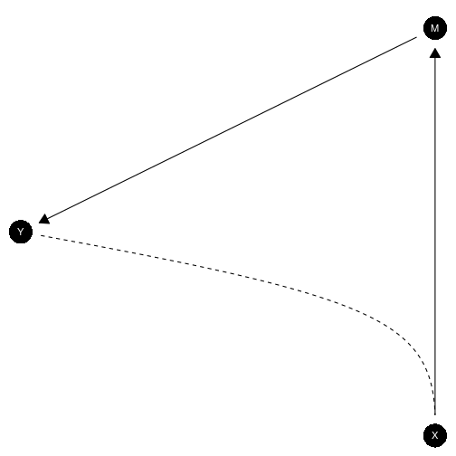
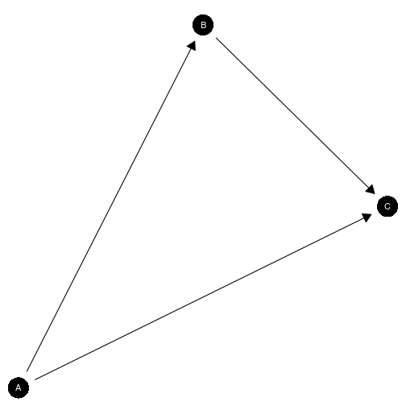
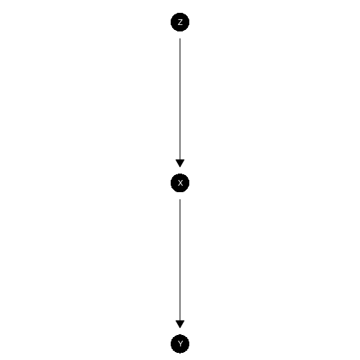
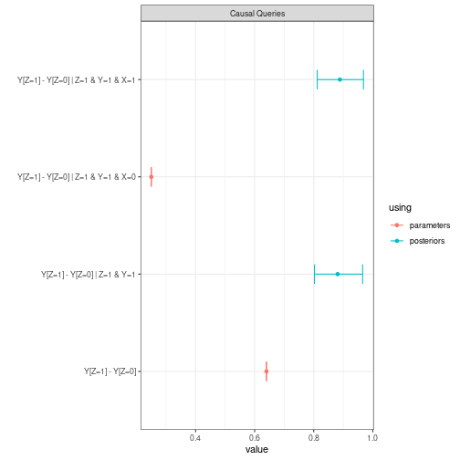
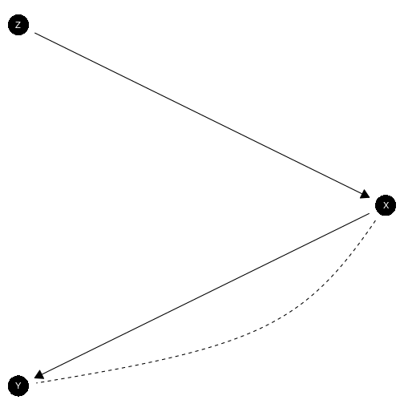
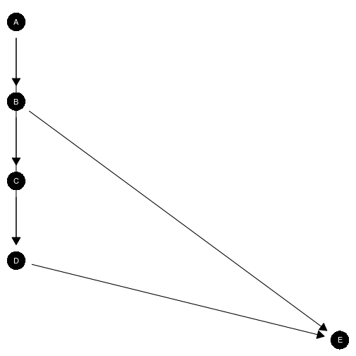
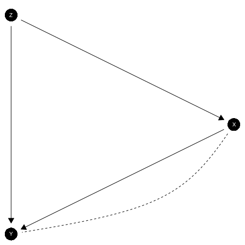

Plotting functionality makes use of the Sugiyama layout from igraph which plots nodes to reflect their position in a causal ordering.

The `plot` method calls `plot_model` and passes provided arguments to it.

## A basic plot:


``` r
model <- make_model("X -> Y")

model |> plot_model()
```



## ggplot layers

The model that is produced is a `ggplot` object and additional layers can be added in the usual way.


``` r
model |>
  plot_model()  +
  annotate("text", x = c(1, -1) , y = c(1.5, 1.5), label = c("Some text", "Some more text")) +
  coord_flip()
```




## Adding labels

Provide labels in the same order as model nodes.


``` r
model <- make_model("A -> B -> C <- A")


# Check node ordering
inspect(model, "nodes")
#> 
#> Nodes: 
#> A, B, C

# Provide labels
model |>
   plot_model(
     labels = c("This is A", "Here is B", "And C"),
     nodecol = "white", textcol = "black")
```



## Controlling  positions

You can manually set positions using the `x_coord` and `y_coord` arguments.

You can manually set positions using the `x_coord` and `y_coord` arguments.


``` r
model |>
  plot(x_coord = 0:2,  y_coord = c(0, 2, 1))
```




## Controlling  color

You can manually control node color and text color for all nodes together or separately.


``` r
model |>
  plot(x_coord = 0:2,  y_coord = c(0, 2, 1),
       nodecol = c("blue", "orange", "red"),
       textcol = c("white", "red", "blue"))
```



# Models with unobserved confounding

Unobserved confounding is represented using dashed curves.


``` r
make_model('X -> K -> Y <- X; X <-> Y; K <-> Y') |>   plot()
```



# More complex models

## Effective node placement


``` r
make_model("I -> V -> G <- N; C -> I <- A -> G; G -> Z",
           add_causal_types = FALSE) |>
  plot()
```




## Requires manual coordinates

This graph has bad node placement.


``` r
make_model("D <- A -> B -> C -> D -> E; B -> E",
           add_causal_types = FALSE) |>
  plot()
```



Better:


``` r
make_model("D <- A -> B -> C -> D -> E; B -> E",
           add_causal_types = FALSE) |>
  plot(x_coord = c(0, -.1, 0, .1, 0), y_coord = 5:1)
```




