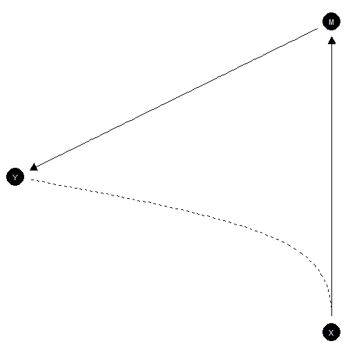

``` r
library(CausalQueries)
library(dplyr)
library(knitr)
```

Here is an example of a model in which `X` causes `M` and  `M` causes `Y`. There is, in addition, unobservable confounding between `X` and `Y`. This is an example of a model in which you might use information on `M` to figure out whether `X` caused `Y` making use of the "front door criterion."

The DAG is defined using `dagitty` syntax like this:


``` r
model <- make_model("X -> M -> Y <-> X")
```

We might set priors thus:


``` r
model <- set_priors(model, distribution = "jeffreys")
#> Altering all parameters.
```

You can plot the dag like this:


``` r
plot(model)
```




Updating is done like this:


``` r
# Lets imagine highly correlated data; here an effect of .9 at each step
data <- data.frame(X = rep(0:1, 2000)) |>
  mutate(
    M = rbinom(n(), 1, .05 + .9*X),
    Y = rbinom(n(), 1, .05 + .9*M))

# Updating
model <- model |> update_model(data, refresh = 0)
```

Finally you can calculate an estimand of interest like this:


``` r
query_model(
    model = model,
    using = c("priors", "posteriors"),
    query = "Y[X=1] - Y[X=0]",
    ) |>
  kable(digits = 2)
```


|label           |query           |given |using      |case_level | mean|   sd| cred.low| cred.high|
|:---------------|:---------------|:-----|:----------|:----------|----:|----:|--------:|---------:|
|Y[X=1] - Y[X=0] |Y[X=1] - Y[X=0] |-     |priors     |FALSE      | 0.00| 0.14|    -0.34|      0.29|
|Y[X=1] - Y[X=0] |Y[X=1] - Y[X=0] |-     |posteriors |FALSE      | 0.79| 0.02|     0.76|      0.82|


This uses the posterior distribution and the model to assess the average treatment effect estimand.

Let's compare now with the case where you do not have data on `M`:


``` r

model |>
  update_model(data |> dplyr::select(X, Y), refresh = 0) |>
  query_model(
    using = c("priors", "posteriors"),
    query = "Y[X=1] - Y[X=0]") |>
  kable(digits = 2)
```


|label           |query           |given |using      |case_level | mean|   sd| cred.low| cred.high|
|:---------------|:---------------|:-----|:----------|:----------|----:|----:|--------:|---------:|
|Y[X=1] - Y[X=0] |Y[X=1] - Y[X=0] |-     |priors     |FALSE      |  0.0| 0.14|    -0.34|      0.34|
|Y[X=1] - Y[X=0] |Y[X=1] - Y[X=0] |-     |posteriors |FALSE      |  0.1| 0.17|    -0.03|      0.60|


Here we update much less and are (relatively) much less certain in our beliefs precisely because we are aware of the confounded related between `X` and `Y`, without having the data on `M` we could use to address it.

# Try it

Say `X`, `M`, and `Y` were perfectly correlated. Would the average treatment effect be identified?
