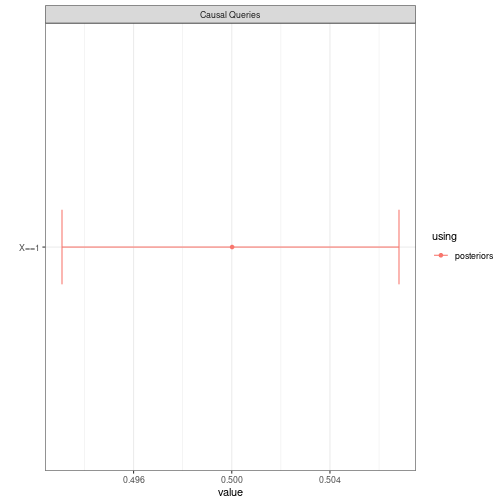
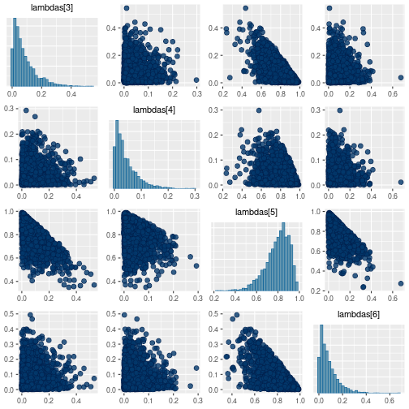
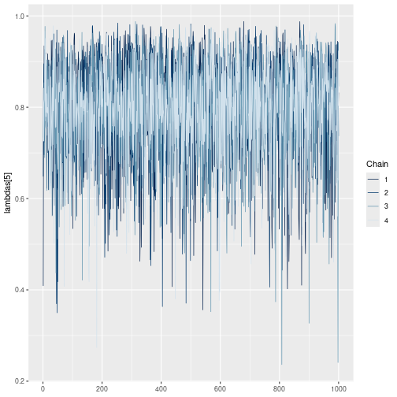

``` r

library(CausalQueries)
library(knitr)
library(ggplot2)
library(rstan)
library(bayesplot)
rstan_options(refresh = 0)
```

# Accessing the posterior

When you update a model using `CausalQueries`, `CausalQueries` generates and updates a `stan` model and saves the posterior distribution over parameters in the model.

The basic usage is:


``` r
data <- data.frame(X = rep(c(0:1), 10), Y = rep(c(0:1), 10))

model <- make_model("X -> Y") |>
  update_model(data)
```


The posterior over parameters can be accessed thus:


``` r
inspect(model, "posterior_distribution")
#> 
#> posterior_distribution
#> Summary statistics of model parameters posterior distributions:
#> 
#>   Distributions matrix dimensions are 
#>   4000 rows (draws) by 6 cols (parameters)
#> 
#>      mean   sd
#> X.0  0.50 0.10
#> X.1  0.50 0.10
#> Y.00 0.08 0.07
#> Y.10 0.04 0.04
#> Y.01 0.80 0.11
#> Y.11 0.08 0.07
```

When querying a model you can request use of the posterior distribution with the `using` argument:


``` r
model |>
  query_model(
    query = "Y[X=1] > Y[X=0]",
    using = c("priors", "posteriors")) |>
  kable(digits = 2)
```


|query           |given |using      |case_level | mean|   sd| cred.low| cred.high|
|:---------------|:-----|:----------|:----------|----:|----:|--------:|---------:|
|Y[X=1] > Y[X=0] |-     |priors     |FALSE      | 0.25| 0.20|     0.01|      0.71|
|Y[X=1] > Y[X=0] |-     |posteriors |FALSE      | 0.80| 0.11|     0.54|      0.96|


# Summary of stan performance

You can access a summary of the parameter values and convergence information as produced by `stan` thus:


``` r
inspect(model, "stan_summary")
#> 
#> stan_summary
#> Stan model summary:
#> 
#> Inference for Stan model: simplexes.
#> 4 chains, each with iter=2000; warmup=1000; thin=1; 
#> post-warmup draws per chain=1000, total post-warmup draws=4000.
#> 
#>              mean se_mean   sd   2.5%    25%    50%    75%  97.5% n_eff Rhat
#> X.0          0.50    0.00 0.10   0.30   0.42   0.50   0.57   0.70  2379    1
#> X.1          0.50    0.00 0.10   0.30   0.43   0.50   0.58   0.70  2379    1
#> Y.00         0.08    0.00 0.07   0.00   0.03   0.06   0.12   0.27  1997    1
#> Y.10         0.04    0.00 0.04   0.00   0.01   0.03   0.06   0.15  4258    1
#> Y.01         0.80    0.00 0.11   0.54   0.74   0.82   0.88   0.96  4188    1
#> Y.11         0.08    0.00 0.07   0.00   0.02   0.06   0.11   0.27  4147    1
#> X0.Y00       0.04    0.00 0.04   0.00   0.01   0.03   0.06   0.14  2133    1
#> X1.Y00       0.04    0.00 0.04   0.00   0.01   0.03   0.06   0.14  1980    1
#> X0.Y10       0.02    0.00 0.02   0.00   0.01   0.01   0.03   0.08  4146    1
#> X1.Y10       0.02    0.00 0.02   0.00   0.01   0.01   0.03   0.08  3951    1
#> X0.Y01       0.40    0.00 0.10   0.21   0.33   0.39   0.47   0.60  2610    1
#> X1.Y01       0.40    0.00 0.10   0.22   0.33   0.40   0.47   0.61  2922    1
#> X0.Y11       0.04    0.00 0.04   0.00   0.01   0.03   0.05   0.14  4076    1
#> X1.Y11       0.04    0.00 0.04   0.00   0.01   0.03   0.05   0.15  3870    1
#> lp__       -14.61    0.04 1.56 -18.51 -15.41 -14.26 -13.46 -12.65  1292    1
#> 
#> Samples were drawn using NUTS(diag_e) at Tue Dec 10 17:55:28 2024.
#> For each parameter, n_eff is a crude measure of effective sample size,
#> and Rhat is the potential scale reduction factor on split chains (at 
#> convergence, Rhat=1).
```

This summary provides information on the distribution of parameters as well as convergence diagnostics, summarized in the `Rhat` column. In the printout above the first six rows show the distribution of the model parameters; the next eight rows show the distribution over transformed parameters, here the causal types. The last row shows the unnormalized log density on Stan's unconstrained space which, as described in [Stan documentation](https://mc-stan.org/cmdstanr/reference/fit-method-lp.html) is intended to diagnose sampling efficiency and evaluate approximations.

See [stan documentation](http://mc-stan.org/rstan/articles/stanfit_objects.html) for further details.

# Warnings!

We will pass on a summary of warnings generated by `stan` when there are indications that updating has not gone well.

The below produces warnings as it is executed. (Here there are few iterations but also it is a difficult model as data is entirely missing on a mediator and the data pattern is consistent with two opposite models: one combining positive effects and one combining negative effects.)


``` r
model <-
  make_model("X -> M -> Y; M <-> Y") |>
  update_model(data = data.frame(X = rep(0:1, 10000), Y = rep(0:1, 10000)),
               iter = 500,
               refresh = 0)
#> Warning: The largest R-hat is 1.73, indicating chains have not mixed.
#> Running the chains for more iterations may help. See
#> https://mc-stan.org/misc/warnings.html#r-hat
#> Warning: Bulk Effective Samples Size (ESS) is too low, indicating posterior means and medians may be unreliable.
#> Running the chains for more iterations may help. See
#> https://mc-stan.org/misc/warnings.html#bulk-ess
#> Warning: Tail Effective Samples Size (ESS) is too low, indicating posterior variances and tail quantiles may be unreliable.
#> Running the chains for more iterations may help. See
#> https://mc-stan.org/misc/warnings.html#tail-ess
```

You can access a summary of these warnings like this:


``` r
inspect(model, "stan_warnings")
#> 
#> stan_warnings
#> Stan warnings generated during updating:
#> The largest R-hat is 1.73, indicating chains have not mixed
#> Bulk Effective Samples Size (ESS) is too low
#> Tail Effective Samples Size (ESS) is too low
```

But we will also remind you about them when you use the `print` or `summary` methods:


``` r
model
#> 
#> Causal statement: 
#> M -> Y; M <-> Y; X -> M
#> 
#> Number of nodal types by node:
#> X M Y 
#> 2 4 4 
#> 
#> Number of causal types: 32
#> 
#> Model has been updated and contains a posterior distribution with
#> 4 chains, each with iter=2000; warmup=1000; thin=1;  
#> Use inspect(model, 'stan_objects') to inspect stan summary
#> 
#> Warnings passed from rstan during updating:
#> The largest R-hat is 1.73, indicating chains have not mixed
#> Bulk Effective Samples Size (ESS) is too low
#> Tail Effective Samples Size (ESS) is too low
```


And also when you query the model:


``` r
query_model(model, "X==1", using = "posteriors")
#> Note: warnings passed from rstan during updating:
#> 
#> Model 1 warnings:
#> The largest R-hat is 1.73, indicating chains have not mixed
#> Bulk Effective Samples Size (ESS) is too low
#> Tail Effective Samples Size (ESS) is too low
#> 
#> 
#> Causal queries generated by query_model (all at population level)
#> 
#> |query |using      | mean|    sd| cred.low| cred.high|
#> |:-----|:----------|----:|-----:|--------:|---------:|
#> |X==1  |posteriors |  0.5| 0.004|    0.493|     0.507|
```


``` r
query_model(model, "X==1", using = "posteriors") |> plot()
#> Note: warnings passed from rstan during updating:
#> 
#> Model 1 warnings:
#> The largest R-hat is 1.73, indicating chains have not mixed
#> Bulk Effective Samples Size (ESS) is too low
#> Tail Effective Samples Size (ESS) is too low
```



These warnings are not always important but safest to be aware of them if they arise and to investigate further. For more on warnings see [stan post on warnings](https://mc-stan.org/misc/warnings.html).

# Advanced diagnostics

If you are interested in advanced diagnostics of performance you can save and access the `raw` stan output.


``` r
model <- make_model("X -> Y") |>
  update_model(data, keep_fit = TRUE)
```


Note that the summary for this raw output shows the labels used in the generic `stan` model: `lambda` for the vector of parameters, corresponding to the parameters in the parameters dataframe  (`inspect(model, "parameters_df")`), and , if saved,  a vector `types` for the causal types (see `inspect(model, "causal_types")`) and `w` for the event probabilities (`inspect(model, "prior_event_probabilities")`).


``` r
model |> inspect("stanfit")
#> 
#> stanfit
#> Stan model summary:
#> Inference for Stan model: simplexes.
#> 4 chains, each with iter=2000; warmup=1000; thin=1; 
#> post-warmup draws per chain=1000, total post-warmup draws=4000.
#> 
#>              mean se_mean   sd   2.5%    25%    50%    75%  97.5% n_eff Rhat
#> lambdas[1]   0.50    0.00 0.10   0.30   0.43   0.50   0.57   0.70  1935    1
#> lambdas[2]   0.50    0.00 0.10   0.30   0.43   0.50   0.57   0.70  1935    1
#> lambdas[3]   0.08    0.00 0.08   0.00   0.03   0.06   0.12   0.28  2022    1
#> lambdas[4]   0.04    0.00 0.04   0.00   0.01   0.03   0.06   0.15  4325    1
#> lambdas[5]   0.80    0.00 0.11   0.54   0.73   0.81   0.88   0.96  3997    1
#> lambdas[6]   0.08    0.00 0.07   0.00   0.03   0.06   0.11   0.27  4322    1
#> types[1]     0.04    0.00 0.04   0.00   0.01   0.03   0.06   0.15  2159    1
#> types[2]     0.04    0.00 0.04   0.00   0.01   0.03   0.06   0.15  1952    1
#> types[3]     0.02    0.00 0.02   0.00   0.01   0.01   0.03   0.08  3866    1
#> types[4]     0.02    0.00 0.02   0.00   0.01   0.01   0.03   0.08  4153    1
#> types[5]     0.40    0.00 0.10   0.20   0.33   0.39   0.46   0.60  2272    1
#> types[6]     0.40    0.00 0.10   0.22   0.33   0.40   0.47   0.61  2371    1
#> types[7]     0.04    0.00 0.04   0.00   0.01   0.03   0.06   0.14  4011    1
#> types[8]     0.04    0.00 0.04   0.00   0.01   0.03   0.06   0.14  4110    1
#> lp__       -14.60    0.05 1.56 -18.57 -15.39 -14.20 -13.46 -12.65  1176    1
#> 
#> Samples were drawn using NUTS(diag_e) at Tue Dec 10 17:55:42 2024.
#> For each parameter, n_eff is a crude measure of effective sample size,
#> and Rhat is the potential scale reduction factor on split chains (at 
#> convergence, Rhat=1).
```


You can then  use diagnostic packages such as `bayesplot`.


``` r
model |> inspect("stanfit") |>
  bayesplot::mcmc_pairs(pars = c("lambdas[3]", "lambdas[4]", "lambdas[5]", "lambdas[6]"))
#> 
#> stanfit
#> Stan model summary:
#> Inference for Stan model: simplexes.
#> 4 chains, each with iter=2000; warmup=1000; thin=1; 
#> post-warmup draws per chain=1000, total post-warmup draws=4000.
#> 
#>              mean se_mean   sd   2.5%    25%    50%    75%  97.5% n_eff Rhat
#> lambdas[1]   0.50    0.00 0.10   0.30   0.43   0.50   0.57   0.70  1935    1
#> lambdas[2]   0.50    0.00 0.10   0.30   0.43   0.50   0.57   0.70  1935    1
#> lambdas[3]   0.08    0.00 0.08   0.00   0.03   0.06   0.12   0.28  2022    1
#> lambdas[4]   0.04    0.00 0.04   0.00   0.01   0.03   0.06   0.15  4325    1
#> lambdas[5]   0.80    0.00 0.11   0.54   0.73   0.81   0.88   0.96  3997    1
#> lambdas[6]   0.08    0.00 0.07   0.00   0.03   0.06   0.11   0.27  4322    1
#> types[1]     0.04    0.00 0.04   0.00   0.01   0.03   0.06   0.15  2159    1
#> types[2]     0.04    0.00 0.04   0.00   0.01   0.03   0.06   0.15  1952    1
#> types[3]     0.02    0.00 0.02   0.00   0.01   0.01   0.03   0.08  3866    1
#> types[4]     0.02    0.00 0.02   0.00   0.01   0.01   0.03   0.08  4153    1
#> types[5]     0.40    0.00 0.10   0.20   0.33   0.39   0.46   0.60  2272    1
#> types[6]     0.40    0.00 0.10   0.22   0.33   0.40   0.47   0.61  2371    1
#> types[7]     0.04    0.00 0.04   0.00   0.01   0.03   0.06   0.14  4011    1
#> types[8]     0.04    0.00 0.04   0.00   0.01   0.03   0.06   0.14  4110    1
#> lp__       -14.60    0.05 1.56 -18.57 -15.39 -14.20 -13.46 -12.65  1176    1
#> 
#> Samples were drawn using NUTS(diag_e) at Tue Dec 10 17:55:42 2024.
#> For each parameter, n_eff is a crude measure of effective sample size,
#> and Rhat is the potential scale reduction factor on split chains (at 
#> convergence, Rhat=1).
```




``` r
np <- model |> inspect("stanfit") |> bayesplot::nuts_params()
#> 
#> stanfit
#> Stan model summary:
#> Inference for Stan model: simplexes.
#> 4 chains, each with iter=2000; warmup=1000; thin=1; 
#> post-warmup draws per chain=1000, total post-warmup draws=4000.
#> 
#>              mean se_mean   sd   2.5%    25%    50%    75%  97.5% n_eff Rhat
#> lambdas[1]   0.50    0.00 0.10   0.30   0.43   0.50   0.57   0.70  1935    1
#> lambdas[2]   0.50    0.00 0.10   0.30   0.43   0.50   0.57   0.70  1935    1
#> lambdas[3]   0.08    0.00 0.08   0.00   0.03   0.06   0.12   0.28  2022    1
#> lambdas[4]   0.04    0.00 0.04   0.00   0.01   0.03   0.06   0.15  4325    1
#> lambdas[5]   0.80    0.00 0.11   0.54   0.73   0.81   0.88   0.96  3997    1
#> lambdas[6]   0.08    0.00 0.07   0.00   0.03   0.06   0.11   0.27  4322    1
#> types[1]     0.04    0.00 0.04   0.00   0.01   0.03   0.06   0.15  2159    1
#> types[2]     0.04    0.00 0.04   0.00   0.01   0.03   0.06   0.15  1952    1
#> types[3]     0.02    0.00 0.02   0.00   0.01   0.01   0.03   0.08  3866    1
#> types[4]     0.02    0.00 0.02   0.00   0.01   0.01   0.03   0.08  4153    1
#> types[5]     0.40    0.00 0.10   0.20   0.33   0.39   0.46   0.60  2272    1
#> types[6]     0.40    0.00 0.10   0.22   0.33   0.40   0.47   0.61  2371    1
#> types[7]     0.04    0.00 0.04   0.00   0.01   0.03   0.06   0.14  4011    1
#> types[8]     0.04    0.00 0.04   0.00   0.01   0.03   0.06   0.14  4110    1
#> lp__       -14.60    0.05 1.56 -18.57 -15.39 -14.20 -13.46 -12.65  1176    1
#> 
#> Samples were drawn using NUTS(diag_e) at Tue Dec 10 17:55:42 2024.
#> For each parameter, n_eff is a crude measure of effective sample size,
#> and Rhat is the potential scale reduction factor on split chains (at 
#> convergence, Rhat=1).
head(np) |> kable()
```


| Chain| Iteration|Parameter     |     Value|
|-----:|---------:|:-------------|---------:|
|     1|         1|accept_stat__ | 0.9959091|
|     1|         2|accept_stat__ | 0.9956753|
|     1|         3|accept_stat__ | 0.9998583|
|     1|         4|accept_stat__ | 0.9154293|
|     1|         5|accept_stat__ | 0.9825772|
|     1|         6|accept_stat__ | 0.9810383|


``` r

model |>
  inspect("stanfit") |>
  bayesplot::mcmc_trace(pars = "lambdas[5]", np = np)
#> 
#> stanfit
#> Stan model summary:
#> Inference for Stan model: simplexes.
#> 4 chains, each with iter=2000; warmup=1000; thin=1; 
#> post-warmup draws per chain=1000, total post-warmup draws=4000.
#> 
#>              mean se_mean   sd   2.5%    25%    50%    75%  97.5% n_eff Rhat
#> lambdas[1]   0.50    0.00 0.10   0.30   0.43   0.50   0.57   0.70  1935    1
#> lambdas[2]   0.50    0.00 0.10   0.30   0.43   0.50   0.57   0.70  1935    1
#> lambdas[3]   0.08    0.00 0.08   0.00   0.03   0.06   0.12   0.28  2022    1
#> lambdas[4]   0.04    0.00 0.04   0.00   0.01   0.03   0.06   0.15  4325    1
#> lambdas[5]   0.80    0.00 0.11   0.54   0.73   0.81   0.88   0.96  3997    1
#> lambdas[6]   0.08    0.00 0.07   0.00   0.03   0.06   0.11   0.27  4322    1
#> types[1]     0.04    0.00 0.04   0.00   0.01   0.03   0.06   0.15  2159    1
#> types[2]     0.04    0.00 0.04   0.00   0.01   0.03   0.06   0.15  1952    1
#> types[3]     0.02    0.00 0.02   0.00   0.01   0.01   0.03   0.08  3866    1
#> types[4]     0.02    0.00 0.02   0.00   0.01   0.01   0.03   0.08  4153    1
#> types[5]     0.40    0.00 0.10   0.20   0.33   0.39   0.46   0.60  2272    1
#> types[6]     0.40    0.00 0.10   0.22   0.33   0.40   0.47   0.61  2371    1
#> types[7]     0.04    0.00 0.04   0.00   0.01   0.03   0.06   0.14  4011    1
#> types[8]     0.04    0.00 0.04   0.00   0.01   0.03   0.06   0.14  4110    1
#> lp__       -14.60    0.05 1.56 -18.57 -15.39 -14.20 -13.46 -12.65  1176    1
#> 
#> Samples were drawn using NUTS(diag_e) at Tue Dec 10 17:55:42 2024.
#> For each parameter, n_eff is a crude measure of effective sample size,
#> and Rhat is the potential scale reduction factor on split chains (at 
#> convergence, Rhat=1).
#> No divergences to plot.
```




