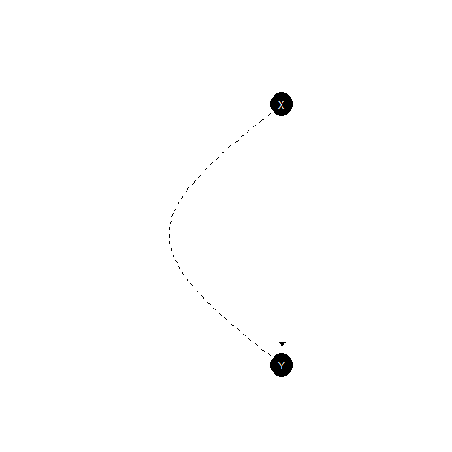

<!-- Generated by CausalQueries:::build_vignettes(); edit g-factorized-path.Rmd.orig instead. Do not edit this file. -->


``` r
library(CausalQueries)
library(knitr)
options(CausalQueries.legacy = FALSE) # package default; set explicitly for clarity
CausalQueries:::enable_stan_parallel(quiet = TRUE)
```

# What this vignette is about

`CausalQueries` can work in two ways:

* **Factorized** (`legacy = FALSE`, the default): keep beliefs about **nodal parameters** (the lambdas on each node's response schedule). Update and query without building a giant table of every possible combination of those schedules.
* **Legacy** (`legacy = TRUE`): expand **causal types** (full combinations), keep a type matrix `P`, and (optionally) a type-level posterior.

Both aim at the **same numerical answers** on the models where both apply. This vignette explains the factorized path in plain language: how event probabilities are formed, how missing data is handled, what Stan updates, and how queries are evaluated. The running example is a small confounded model:


``` r
model <- make_model("X -> Y; X <-> Y")
plot(model)
```



Read `X -> Y; X <-> Y` as: $X$ affects $Y$, and there is also unobserved confounding between $X$ and $Y$ (the `<->` link).

# The objects that matter

Think in three layers:

1. **Nodal types** — local “how does this node respond?” schedules. For $X$ with no parents: just `0` or `1`. For $Y$ with parent $X$: four schedules usually labelled `00`, `10`, `01`, `11` (response when $X=0$, then when $X=1$).
2. **Parameters (lambdas)** — probabilities over those schedules (Dirichlet priors / posterior draws). Under confounding, $Y$'s parameters are **stratified** by $X$'s type (`parameters_df$given`).
3. **Events** — what the data look like (`X0Y0`, `X1Y1`, …), including **incomplete** rows where some nodes are missing.

You do **not** need a stored list of every causal type for ordinary update and query on this path.


``` r
model$parameters_df[, c("param_names", "node", "nodal_type", "given", "priors")] |>
  kable()
```


|param_names |node |nodal_type |given | priors|
|:-----------|:----|:----------|:-----|------:|
|X.0         |X    |0          |      |      1|
|X.1         |X    |1          |      |      1|
|Y.00_X.0    |Y    |00         |X.0   |      1|
|Y.10_X.0    |Y    |10         |X.0   |      1|
|Y.01_X.0    |Y    |01         |X.0   |      1|
|Y.11_X.0    |Y    |11         |X.0   |      1|
|Y.00_X.1    |Y    |00         |X.1   |      1|
|Y.10_X.1    |Y    |10         |X.1   |      1|
|Y.01_X.1    |Y    |01         |X.1   |      1|
|Y.11_X.1    |Y    |11         |X.1   |      1|


With flat priors, each simplex is uniform over its rows.

# Complete data: probability of one observed world

## Unconfounded warmup (`X -> Y`)

Without confounding, a complete world $(X=x,Y=y)$ has probability

> (probability of $X$'s value) × (probability that $Y$'s schedule produces $y$ given $x$).

Under flat priors that product is $1/4$ for each of the four complete patterns:


``` r
xy <- make_model("X -> Y")
get_event_probabilities(xy) |> kable(digits = 3)
```


|     | event_probs|
|:----|-----------:|
|X0Y0 |        0.25|
|X1Y0 |        0.25|
|X0Y1 |        0.25|
|X1Y1 |        0.25|


Hand check for `X0Y0`:

* $P(X=0)=\lambda_{X.0}=1/2$
* Given $X=0$, $Y=0$ if $Y$'s schedule has first digit `0` (types `00` and `01`), each with mass $1/4$, so $1/2$
* Product: $1/2 \times 1/2 = 1/4$

Internally the factorized code does the same lookup **node by node** (no causal-type table):


``` r
# Illustrative internal helpers (not part of the public API)
params <- get_parameters(xy)
assignment <- list(X = 0L, Y = 0L)
pX <- CausalQueries:::nodal_assignment_prob(xy, params, "X", assignment)
pY <- CausalQueries:::nodal_assignment_prob(xy, params, "Y", assignment)
c(P_X = pX, P_Y_given_parents = pY, product = pX * pY)
#>               P_X P_Y_given_parents           product 
#>              0.50              0.50              0.25
```

## Confounded running example (`X -> Y; X <-> Y`)

Confounding means $X$ and $Y$'s schedules are **not** independent: $Y$'s lambdas come in strata keyed to $X$'s nodal type. The probability of a complete world is still “multiply the node contributions,” but the $Y$ contribution must pick the stratum that matches $X$'s type along each **path** Stan uses. The public summary is still:


``` r
get_event_probabilities(model) |> kable(digits = 3)
```


|     | event_probs|
|:----|-----------:|
|X0Y0 |        0.25|
|X1Y0 |        0.25|
|X0Y1 |        0.25|
|X1Y1 |        0.25|


So the bookkeeping is richer, but the *user* idea is unchanged: parameters → probability of each fully observed pattern.

# Incomplete data: add the possibilities you did not see

Suppose we only learn $Y=1$, and $X$ is missing. The probability of that **coarsened** event is the sum of complete worlds consistent with it:

$$
P(Y=1) = P(X=0,Y=1) + P(X=1,Y=1).
$$

That is all “variable elimination” means here for data: **sum out** the nodes you did not observe.


``` r
w <- get_event_probabilities(model)
grid <- get_all_data_types(model, complete_data = TRUE)
p_Y1_hand <- sum(w[grid$Y == 1])
p_Y1_hand
#> [1] 0.5
```

The factorized helper does the same sum without asking you to build the table yourself (and on larger unconfounded graphs it can avoid listing every world):


``` r
CausalQueries:::prob_event_ve(model, evidence = list(Y = 1L))
#> [1] 0.5
```

For a chain of many nodes where you only observe the ends, the same idea applies: fix what you saw, add up (eliminate) what you did not. Stan update still uses a complete-data grid under a size cap (see the last section); R-side queries and event probabilities can use this elimination step directly.

# How `update_model` works (factorized)

Updating still means: put a prior on the lambdas, see data, get a posterior over lambdas. The Stan file `simplexes_factorized.stan` never needs a causal-type matrix `P`. In outline:

1. **Parameters** — one Dirichlet simplex per parameter set (a node, or a confound stratum).
2. **Paths / `parmap`** — for each complete-data column, which lambdas are active at each node (confound may split paths; `map` aggregates paths back to data patterns).
3. **`w`** — probability of each complete pattern (product over nodes of the active lambda mass).
4. **`E`** — maps possibly **coarsened** observed events to those complete patterns (`w_full = E %*% w`).
5. **Likelihood** — multinomial over events within each missingness **strategy** (same as legacy).

A compact view of the Stan arithmetic (simplified):

```stan
// for each path i: product over nodes of (sum of active lambdas)
w_0[i] = exp(sum_j log(node_prob[j, i]));
w = map' * w_0;
w_full = E * w;
// then multinomial(Y | w_full within each strategy)
```

On our small model, prep exposes those dimensions:


``` r
set.seed(1)
data <- make_data(model, n = 40) |> collapse_data(model)
stan_data <- CausalQueries:::prep_stan_data_factorized(model, data)
c(
  n_params = stan_data$n_params,
  n_paths = stan_data$n_paths,
  n_data = stan_data$n_data,
  n_events = stan_data$n_events,
  n_strategies = stan_data$n_strategies
)
#>     n_params      n_paths       n_data     n_events n_strategies 
#>           10            4            4            4            1
```

A short update (for illustration; vignettes precompute so CRAN need not re-run Stan):


``` r
model <- model |>
  update_model(data, iter = 1000, chains = 2, seed = 1)
```


``` r
inspect(model, "posterior_distribution") |>
  head() |>
  kable(digits = 3)
#> 
#> posterior_distribution
#> Summary statistics of model parameters posterior distributions:
#> 
#>   Distributions matrix dimensions are 
#>   1000 rows (draws) by 10 cols (parameters)
#> 
#>          mean   sd
#> X.0      0.48 0.08
#> X.1      0.52 0.08
#> Y.00_X.0 0.21 0.14
#> Y.10_X.0 0.28 0.18
#> Y.01_X.0 0.22 0.14
#> Y.11_X.0 0.28 0.18
#> Y.00_X.1 0.24 0.15
#> Y.10_X.1 0.24 0.15
#> Y.01_X.1 0.27 0.16
#> Y.11_X.1 0.26 0.16
```


|   X.0|   X.1| Y.00_X.0| Y.10_X.0| Y.01_X.0| Y.11_X.0| Y.00_X.1| Y.10_X.1| Y.01_X.1| Y.11_X.1|
|-----:|-----:|--------:|--------:|--------:|--------:|--------:|--------:|--------:|--------:|
| 0.629| 0.371|    0.092|    0.320|    0.392|    0.197|    0.199|    0.246|    0.430|    0.125|
| 0.491| 0.509|    0.369|    0.149|    0.104|    0.377|    0.197|    0.195|    0.085|    0.523|
| 0.486| 0.514|    0.431|    0.175|    0.057|    0.337|    0.261|    0.188|    0.134|    0.416|
| 0.447| 0.553|    0.160|    0.472|    0.104|    0.264|    0.005|    0.575|    0.352|    0.068|
| 0.525| 0.475|    0.164|    0.593|    0.146|    0.096|    0.335|    0.056|    0.072|    0.538|
| 0.519| 0.481|    0.349|    0.417|    0.129|    0.104|    0.188|    0.276|    0.256|    0.280|


The fitted model is stamped `legacy = FALSE`. Later `query_*` calls inherit that stamp. There is no `type_posterior` on this path; draws of interest are the **parameters**.

# How `query_model` works (factorized)

A query such as the ATE, $Y[X=1] - Y[X=0]$, asks about **interventions**, not only about observed events. The factorized evaluator:

1. Finds which nodes' types actually matter for the query (and for any `given`).
2. Under confounding, keeps confound partners in the same **block** (do not cut `<->`).
3. Builds only that **relevant** set of type combinations.
4. For each parameter draw, weights those types by the right lambdas (respecting `given` strata) and averages the query.


``` r
query_model(
  make_model("X -> Y; X <-> Y"),
  query = "Y[X=1] - Y[X=0]",
  using = "parameters"
) |>
  kable(digits = 3)
```


|label           |query           |given |using      |case_level | mean| sd| cred.low| cred.high|
|:---------------|:---------------|:-----|:----------|:----------|----:|--:|--------:|---------:|
|Y[X=1] - Y[X=0] |Y[X=1] - Y[X=0] |-     |parameters |FALSE      |    0| NA|        0|         0|


``` r
query_model(
  model,
  query = "Y[X=1] - Y[X=0]",
  given = "Y==1",
  using = "posteriors"
) |>
  kable(digits = 3)
```


|label                         |query           |given |using      |case_level |  mean|    sd| cred.low| cred.high|
|:-----------------------------|:---------------|:-----|:----------|:----------|-----:|-----:|--------:|---------:|
|Y[X=1] - Y[X=0] :&#124;: Y==1 |Y[X=1] - Y[X=0] |Y==1  |posteriors |FALSE      | 0.008| 0.229|   -0.425|     0.446|


Observational `given` clauses like `Y==1` restrict attention to units consistent with that data pattern. Whether you think of that as “conditioning on an event” or “keeping types that realize the event,” the answers are pinned against the legacy path in the test suite.

## Query evaluators (`query_eval`) — not a second `legacy`

Under `legacy = FALSE` only, `query_model` / `query_distribution` accept `query_eval`:

| Value | Role | Risk if you call it |
|-------|------|---------------------|
| `"grid"` (default) | Relevant-set expand + `realise_outcomes` + `map_query_to_causal_type` | Refuses if the type product exceeds ~1e6 |
| `"ve"` | **Chunked** walk of the same sum (higher cap) | Runtime still scales with the product — can look hung |
| `"ve_struct"` | Structural twin-network sum-product (flat `do`) | Nested do falls back with a message; prefer for long-chain / Trust-like TEs |
| `"auto"` | grid if product fits, else chunked `"ve"` | Never selects `"ve_struct"`; overflow can hang like `"ve"` |

This is **not** a `legacy` × `query_eval` matrix. Keep `"grid"` for ordinary work and pins. See `?query_model` (*Factorized query_eval risks*).

The two factorized evaluators are meant to return the **same number** whenever both run. Here is a confounded ATE and a chain TE, each computed both ways:


``` r
# 1) Confounded ATE: grid vs ve_struct (non-flat parameters so the shared
#    number is visibly non-zero)
m_xy <- make_model("X -> Y; X <-> Y") |>
  set_parameters(
    param_names = c("Y.10_X.0", "Y.01_X.0", "Y.10_X.1", "Y.01_X.1"),
    parameters = c(0.1, 0.4, 0.2, 0.5)
  )
params_xy <- get_parameters(m_xy)
q_ate <- "Y[X=1] - Y[X=0]"
cmp_xy <- data.frame(
  model = "X -> Y; X <-> Y",
  query = q_ate,
  grid = as.numeric(query_distribution(
    m_xy, q_ate, parameters = params_xy, query_eval = "grid"
  )),
  ve_struct = as.numeric(query_distribution(
    m_xy, q_ate, parameters = params_xy, query_eval = "ve_struct"
  ))
)
cmp_xy$abs_diff <- abs(cmp_xy$grid - cmp_xy$ve_struct)

# 2) Chain TE with tilted parameters
m_ch <- make_model("A -> B -> C -> D") |>
  set_parameters(
    param_names = c("B.01", "C.01", "D.01"),
    parameters = c(0.8, 0.7, 0.9)
  )
params_ch <- get_parameters(m_ch)
q_ch <- "D[A=1] - D[A=0]"
cmp_ch <- data.frame(
  model = "A -> B -> C -> D",
  query = q_ch,
  grid = as.numeric(query_distribution(
    m_ch, q_ch, parameters = params_ch, query_eval = "grid"
  )),
  ve_struct = as.numeric(query_distribution(
    m_ch, q_ch, parameters = params_ch, query_eval = "ve_struct"
  ))
)
cmp_ch$abs_diff <- abs(cmp_ch$grid - cmp_ch$ve_struct)

rbind(cmp_xy, cmp_ch) |> kable(digits = 10)
```


|model            |query           |      grid| ve_struct| abs_diff|
|:----------------|:---------------|---------:|---------:|--------:|
|X -> Y; X <-> Y  |Y[X=1] - Y[X=0] | 0.3000000| 0.3000000|        0|
|A -> B -> C -> D |D[A=1] - D[A=0] | 0.3813333| 0.3813333|        0|


``` r
# Same agreement via query_model summaries
bind_rows <- function(...) do.call(rbind, list(...))
qm_grid <- query_model(m_ch, q_ch, using = "parameters",
                       parameters = list(params_ch), query_eval = "grid")
qm_struct <- query_model(m_ch, q_ch, using = "parameters",
                         parameters = list(params_ch), query_eval = "ve_struct")
data.frame(
  query_eval = c("grid", "ve_struct"),
  mean = c(qm_grid$mean, qm_struct$mean)
) |> kable(digits = 10)
```


|query_eval |      mean|
|:----------|---------:|
|grid       | 0.3813333|
|ve_struct  | 0.3813333|


# Large models: make → restrict → update → query

The small confound example fits in memory either way. Theory DAGs with many parents do not: a node with $k$ parents has up to $2^{2^k}$ saturated nodal types. **Legacy** expands the *product* of those schedules into causal types. **Factorized** keeps nodal parameters and only expands what a query needs — or, with `ve_struct`, avoids expanding the product at all for flat interventions.

## Make (and shrink nodal types)


``` r
theory <- make_model(
  "
  Marginalization -> Participation;
  Marginalization -> Understanding;
  Marginalization -> Inclusion;
  Marginalization -> Connections;
  Invitation -> Participation;
  Municipality -> Participation;
  Municipality -> Understanding;
  Municipality -> Inclusion;
  Municipality -> Connections;
  Participation -> Understanding;
  Participation -> Connections;
  Participation -> Inclusion;
  Inclusion -> Trust;
  Understanding -> Trust;
  Connections -> Trust
  ",
  monotone = "m",
  drop_interactions = 3,
  legacy = FALSE
)
#> Participation: kept 32 types (saturated would be 256)
#> Connections: kept 32 types (saturated would be 256)
#> Inclusion: kept 32 types (saturated would be 256)
#> Understanding: kept 32 types (saturated would be 256)
#> Trust: kept 32 types (saturated would be 256)
# Inspect local complexity (not the causal-type product)
vapply(get_nodal_types(theory, collapse = TRUE), length, integer(1))
#>      Invitation Marginalization    Municipality   Participation     Connections 
#>               2               2               2              32              32 
#>       Inclusion   Understanding           Trust 
#>              32              32              32
```

`monotone = "m"` and `drop_interactions` call into `simplify_model()` at build time so mediators keep dozens of types instead of 256. Prefer this over hoping `legacy = TRUE` will cope.

When to stay on **legacy** at make time: you need `causal_types` / `P` attached by default, or you are debugging type-level objects. Otherwise keep `legacy = FALSE` (default).

## Update

Updating is still “prior on lambdas → data → posterior on lambdas.” Stan file `simplexes_factorized.stan` does not store a causal-type matrix. Limits that *do* remain:

* Complete-data columns for Stan scale as $2^n$ (here $n=8$ → 256, fine).
* Raise or respect `options(CausalQueries.factorized_grid_max)` on bigger graphs.
* Pass `legacy = TRUE` to `update_model` only if you need `keep_type_distribution = TRUE` / `type_posterior`.


``` r
set.seed(1)
dat <- make_data(theory, n = 80)
# Short chains for vignette knit time; increase for real analysis
theory <- update_model(
  theory, dat,
  iter = 400, warmup = 200, chains = 1, refresh = 0, seed = 1
)
theory$stan_objects$legacy
#> [1] FALSE
```

## Query (grid vs structural twin VE)

A flat TE such as `Trust[Marginalization=1] - Trust[Marginalization=0]` still involves many mediator types. The **grid** evaluator multiplies those counts (and may refuse). **`ve_struct`** eliminates along the twin network (shared types across the two interventions) so cost tracks a small frontier, not $\prod |T_v|$.

On a **restriction-shrunk sibling** of the same DAG (fewer types, product still fits grid), both evaluators again agree exactly on parameters:


``` r
sib <- suppressMessages(make_model(
  "Marginalization -> Participation -> Trust; Municipality -> Participation",
  monotone = "m",
  drop_interactions = 2,
  legacy = FALSE
)) |>
  set_parameters(
    param_names = c("Participation.0101", "Trust.01"),
    parameters = c(0.75, 0.8)
  )
params_sib <- get_parameters(sib)
q_sib <- "Trust[Marginalization=1] - Trust[Marginalization=0]"
data.frame(
  query_eval = c("grid", "ve_struct"),
  mean = c(
    query_model(sib, q_sib, using = "parameters",
                parameters = list(params_sib), query_eval = "grid")$mean,
    query_model(sib, q_sib, using = "parameters",
                parameters = list(params_sib), query_eval = "ve_struct")$mean
  )
) |> kable(digits = 10)
```


|query_eval |      mean|
|:----------|---------:|
|grid       | 0.5133333|
|ve_struct  | 0.5133333|


On the full theory model, prefer `ve_struct` (grid may refuse or be slow):


``` r
q_te <- "Trust[Marginalization=1] - Trust[Marginalization=0]"
# Relevant-set size (why grid struggles)
tn <- CausalQueries:::query_type_nodes(theory, q_te, "ALL")
n_hat <- CausalQueries:::estimate_relevant_type_product(theory, tn)
c(type_nodes = paste(tn, collapse = ","), product = format(n_hat, scientific = TRUE))
#>                                                                        type_nodes 
#> "Invitation,Municipality,Participation,Connections,Inclusion,Understanding,Trust" 
#>                                                                           product 
#>                                                                    "1.342177e+08"

query_model(
  theory,
  query = q_te,
  using = "parameters",
  query_eval = "ve_struct"
) |>
  kable(digits = 3)
```


|label                                               |query                                               |given |using      |case_level | mean| sd| cred.low| cred.high|
|:---------------------------------------------------|:---------------------------------------------------|:-----|:----------|:----------|----:|--:|--------:|---------:|
|Trust[Marginalization=1] - Trust[Marginalization=0] |Trust[Marginalization=1] - Trust[Marginalization=0] |-     |parameters |FALSE      |    0| NA|        0|         0|


**Intuition (procedures).** Parameters are probabilities over **nodal types** (response schedules). Realising `Trust` under `do(Marginalization=m)` composes those schedules along the DAG. The ATE averages `Trust(1)-Trust(0)` with **one** draw of types in both worlds (twin network). Grid/`ve` enumerate type combinations; `ve_struct` multiplies λ node-by-node (or confound **block**-by-block) while propagating endogenous 0/1 values — see internals `twin_world_admit`, `twin_struct_eliminate`, `nodal_type_parent_index` / `child_value_from_nodal_type` (same encoding as `realise_outcomes_c`).

Nested queries such as `Y[A=1, B=B[A=0], C=0]` are not admitted to `ve_struct` in v1: they fall back to grid/chunked with a **visible message**. Confounded models are supported for flat TE (atomic λ blocks matching `type_weights_matrix`).

# Same answers as legacy (when both apply)

On this small model, event probabilities match the causal-type path:


``` r
m_leg <- make_model("X -> Y; X <-> Y", legacy = TRUE)
m_fac <- make_model("X -> Y; X <-> Y", legacy = FALSE)
p_leg <- get_event_probabilities(m_leg)
p_fac <- get_event_probabilities(m_fac)
max(abs(as.numeric(p_fac) - as.numeric(p_leg[rownames(p_fac), ])))
#> [1] 0
```

Use `legacy = TRUE` when you explicitly need type-level objects (`type_posterior`, full `causal_types` attached by default, etc.). Use the default factorized path for ordinary update and query.

# Scale notes (honest limits)

* **Complete-data columns for Stan** scale as $2^n$ for $n$ binary nodes. Prep refuses grids larger than `getOption("CausalQueries.factorized_grid_max", 4096)` unless you raise that option or shrink the model (`simplify_model()`, restrictions).
* **Incomplete data** is supported: missing nodes are handled by summing consistent completes (`E` in Stan; elimination helpers in R). Missingness does not remove the need for those complete columns inside Stan.
* **Query type products:** `"grid"` ~1e6; chunked `"ve"` higher but still $O(\prod |T_v|)$; `"ve_struct"` for flat TE on sparse DAGs.
* **Very large graphs** with few observed nodes: R-side `prob_event_ve()` can answer “how likely is this partial observation?” without materializing the full grid; MCMC update still needs the Stan encoding above.

# Further reading

* `vignette("a-getting-started")` — basic make / update / query workflow  
* `vignette("e-posteriors")` — inspecting Stan posteriors  
* `?simplify_model` — reducing nodal types on large parent sets  
* `?update_model` / `?query_model` — `legacy`, `query_eval`, and inheritance  
* `memos/plan_structural_twin_ve.md` / `memos/query_twin_network_ve.md` (package source tree) — design notes for evaluators  
